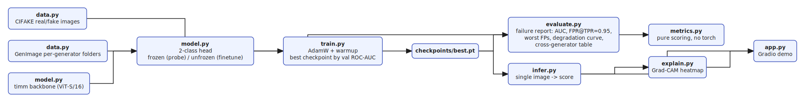
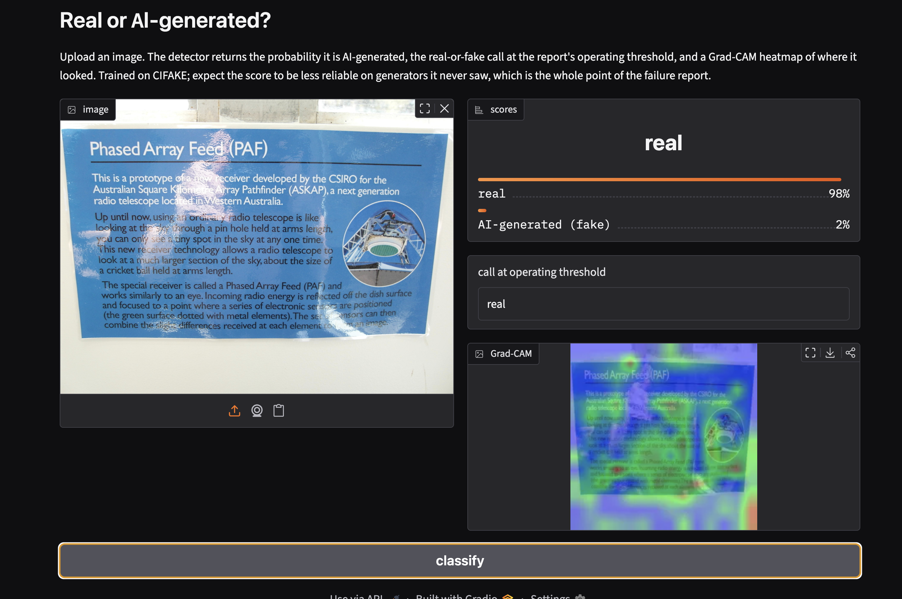
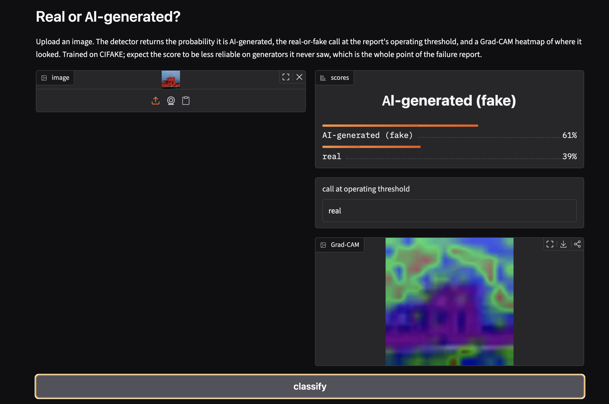
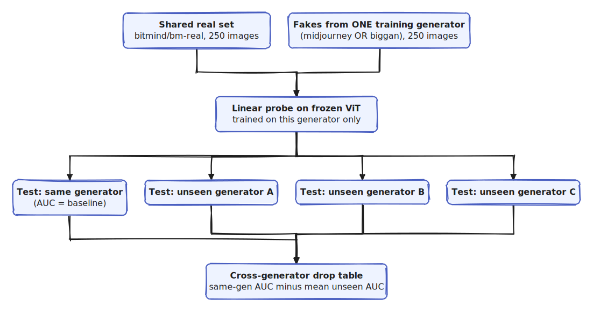

# aigen-image-detector

Tell real photographs apart from AI-generated images. The model is a pretrained vision backbone with
a small head, trained as a linear probe or a full fine-tune. The part that matters is the report it
produces: not one accuracy number, but where the detector fails. Which real images it wrongly flags
as fake, how far its score drops on a generator it never trained on, and how quickly it breaks once
an image is compressed or resized.

## The novel angle

Most AI-image detectors on student portfolios stop at "99 percent accuracy on the test set". That
number is close to meaningless, because the test set comes from the same generator as the training
set, and the real risk is the generator you have not seen yet. This project measures exactly that.
It trains on one source of fakes and tests on others, and it reports the drop instead of hiding it.

Three things the usual demo skips:

- A false-positive report. At a fixed detection rate (catch 95 percent of fakes), how many real
  photos get called fake, and which ones? A false accusation is the expensive error here.
- A cross-generator table. Train on Stable Diffusion images, test on a different generator, and show
  how much the score falls. This is the honest headline.
- A degradation curve. Re-save an image as JPEG or shrink it, and watch the detector degrade. Real
  images on the internet are compressed, so this is the realistic setting.

The faces track runs the same pipeline on deepfake datasets, with a short note on misuse and on what
a wrong call costs a person.

## Features

- A timm vision backbone (ViT or EfficientNet) with a 2-class head, run as a linear probe or a full
  fine-tune behind one config flag.
- A pure metrics module (accuracy, ROC-AUC, FPR at a fixed TPR, cross-generator drop) with unit
  tests, so the numbers are trustworthy.
- A cross-generator split that holds out whole generators for the test set.
- A degradation test under JPEG compression and resizing.
- Grad-CAM heatmaps so a flagged image shows where the model looked.
- A Gradio demo: upload an image, get real-or-fake with a confidence and a heatmap.

## Architecture



Data feeds training, training produces a checkpoint, and that one checkpoint serves both the failure
report and single-image inference. Source: [docs/diagrams/pipeline.excalidraw](docs/diagrams/pipeline.excalidraw),
editable at [excalidraw.com](https://excalidraw.com).

## Demo

The Gradio demo (`uv run python -m aidetect.app`) takes an uploaded image and returns the probability
it is AI-generated, the real-or-fake call at the report's operating threshold, and a Grad-CAM heatmap
of where the model looked.



A real photograph is scored real with 98 percent confidence, and the Grad-CAM overlay shows the model
spreading its attention across the whole frame rather than fixating on one artifact.



The operating threshold at work: this image's raw score leans fake (61 percent), but because that sits
below the checkpoint's 0.688 threshold — the same one the failure report uses — the call is still
`real`. The demo and the report agree on what counts as fake, so the confidence bar and the call can
legitimately disagree near the boundary.

## Setup

Uses [uv](https://docs.astral.sh/uv/) and Python 3.13.

```bash
uv sync
uv sync --extra data    # adds the Hugging Face datasets loader for CIFAKE
```

The linear probe trains on CPU. The full fine-tune and the faces track want a GPU (Colab or Kaggle
both work).

## Usage

```bash
# pull CIFAKE (keyless via Hugging Face) and print links for the rest
uv run python scripts/get_data.py

# train the linear probe, then the full fine-tune
uv run python -m aidetect.train --mode probe
uv run python -m aidetect.train --mode finetune

# the failure report: accuracy, AUC, FPR at TPR=0.95, cross-generator table, degradation curve
uv run python -m aidetect.evaluate --checkpoint checkpoints/best.pt

# cross-generator drop: train on one GenImage generator, test on unseen ones (keyless download)
uv run python scripts/cross_generator_experiment.py --train-gen midjourney
uv run python scripts/cross_generator_experiment.py --train-gen biggan

# or score an existing checkpoint on your own GenImage folders (data/genimage/<gen>/{ai,nature}/)
uv run python -m aidetect.evaluate --checkpoint checkpoints/best_probe.pt --genimage-limit 2000

# one image, with a Grad-CAM heatmap
uv run python -m aidetect.infer --image path/to/img.jpg --heatmap

# demo UI
uv run python -m aidetect.app
```

## Folder structure

```
aigen-image-detector/
  README.md             this file
  pyproject.toml
  docs/
    concepts.md         how AI-image detection works and how to evaluate it honestly
    design-decisions.md why CIFAKE, why FPR-at-TPR, why cross-generator is the real test
    ethics-faces.md     the false-accusation cost and misuse note for the faces track
    diagrams/           architecture diagrams (.excalidraw source + .svg render)
    screenshots/        demo UI screenshots used in this README
  src/aidetect/         the package (config, data, model, metrics, train, evaluate, explain, infer, app)
  tests/                unit tests for the metric and split logic
  scripts/              data fetch helper
  data/                 datasets (gitignored)
  checkpoints/          saved models (gitignored)
```

## Datasets

All public, none scraped. The loaders read files the dataset hosts hand you.

- CIFAKE, real CIFAR-10 plus Stable Diffusion fakes (primary, keyless via Hugging Face):
  https://www.kaggle.com/datasets/birdy654/cifake-real-and-ai-generated-synthetic-images
- GenImage, eight generators, for the cross-generator table:
  https://github.com/GenImage-Dataset/GenImage
- FaceForensics++ (deepfake faces, request access): https://github.com/ondyari/FaceForensics
- DFDC on Kaggle: https://www.kaggle.com/c/deepfake-detection-challenge

## Results

Both detectors use a `vit_small_patch16_224` backbone and are scored on the full 20,000-image CIFAKE
test split. Trained on a 20k subset of the train split (18k train, 2k val) on an Apple-Silicon MPS
device. The probe freezes the backbone and trains a 2-logit head on cached features; the fine-tune
trains the whole model for 2 epochs at a 1e-5 learning rate. Full reports:
[reports/report.md](reports/report.md) (probe) and
[reports/report_finetune.md](reports/report_finetune.md) (fine-tune).

| Setup                   | Accuracy | ROC-AUC | FPR @ TPR=0.95 |
| ----------------------- | -------- | ------- | -------------- |
| Linear probe (CIFAKE)   | 0.920    | 0.977   | 0.116          |
| Full fine-tune (CIFAKE) | 0.961    | 0.993   | 0.031          |

Read the FPR column as the honest operating-point cost: to catch 95 percent of the AI images, the
probe wrongly flags 11.6 percent of real photos as fake (1,143 of 10,000), the fine-tune only 3.1
percent (271 of 10,000). The 12 real images each was most sure were fake are copied to
`reports/false_positives/probe/` and `reports/false_positives/finetune/`.

Degradation under JPEG compression and resizing, on a 4,000-image balanced sample of the test set:

| condition       | clean | jpeg q=50 | jpeg q=10 | resize x0.5 | resize x0.25 |
| --------------- | ----- | --------- | --------- | ----------- | ------------ |
| probe ROC-AUC   | 0.975 | 0.962     | 0.853     | 0.924       | 0.816        |
| finetune ROC-AUC| 0.994 | 0.986     | 0.893     | 0.924       | 0.810        |

The AUC holds through light compression and falls off under heavy JPEG and aggressive downscaling,
which is the expected shape: a chunk of the generator fingerprint lives in the high frequencies that
those operations throw away. Note the last column: the fine-tune is far ahead on clean images, but at
resize x0.25 it lands at 0.810, no better than the probe's 0.816. The extra same-generator accuracy
buys little robustness once the image is degraded, which is the kind of result this project exists to
surface rather than hide.

### Cross-generator generalization (GenImage)

The honest headline. CIFAKE has one generator, so the cross-generator test uses GenImage: train a
probe on one generator with a shared real set (`bitmind/bm-real`), then test on generators it never
saw. The real distribution is identical across train and every test set, so the gap is generator
shift, not domain shift. 250 real and 250 fake images per test set, pulled keyless from the Hugging
Face hub (`scripts/cross_generator_experiment.py`). Reports:
[reports/cross_generator_midjourney.md](reports/cross_generator_midjourney.md) and
[reports/cross_generator_biggan.md](reports/cross_generator_biggan.md).



Source: [docs/diagrams/cross-generator.excalidraw](docs/diagrams/cross-generator.excalidraw).

| trained on | same-gen AUC | mean unseen AUC | change | worst unseen |
| ---------- | ------------ | --------------- | ------ | ------------ |
| MidJourney | 0.919        | 0.962           | -0.043 | glide 0.896  |
| BigGAN     | 0.932        | 0.874           | +0.058 | midjourney 0.835 |

The result is not the simple "always drops" story, and that is the point of measuring it. Transfer is
asymmetric. Train on MidJourney, a strong modern generator with subtle artifacts, and the detector
does fine on older generators (BigGAN 0.991, ADM 1.000) whose artifacts are blatant; the unseen
generators are actually easier. Train on BigGAN and the gap is real and the wrong direction hurts: on
unseen MidJourney the AUC falls to 0.835 and the operating point collapses, FPR at TPR=0.95 is 0.748,
so catching 95 percent of MidJourney fakes would flag three of every four real photos. A detector is
only as good as the hardest generator it was trained against, and a same-generator number hides that.
